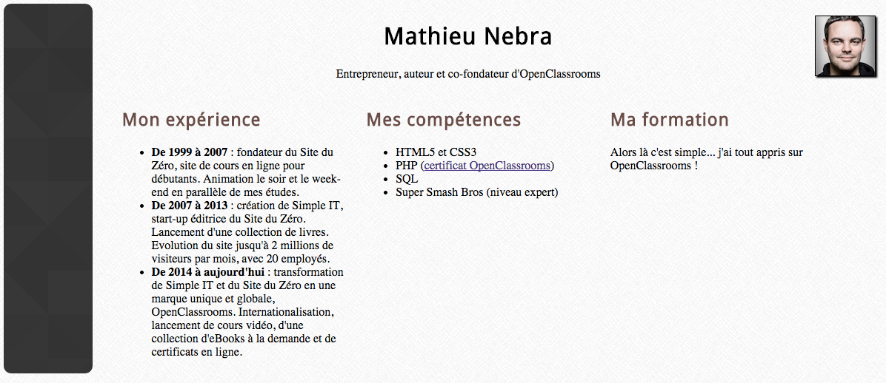
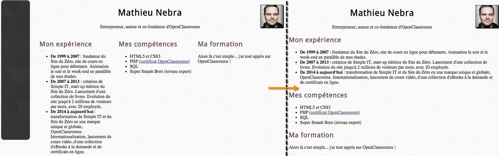

CV en ligne - Cours OpenClassrooms "Apprenez à créer votre site web avec HTML5 et CSS3"
=======================================================================================

Instructions de l'activité du chapitre 1
----------------------------------------

Voici ce que je souhaite voir apparaître sur votre CV :

* Votre nom, en titre principal
* Une courte phrase qui vous décrit, ou une citation, en-dessous du nom
* Une photo miniature, sur laquelle on pourra cliquer pour avoir une version agrandie
* 3 sections délimitées par des titres différents :
   - Mon expérience
   - Mes compétences
   - Ma formation

Pensez à bien utiliser des balises de titre, de paragraphe et des listes à puces lorsque cela vous semble nécessaire. Et pensez à joindre les images utilisées dans le ZIP en plus du fichier .html !

Instructions de l'activité du chapitre 2
----------------------------------------

Je vais vous demander de partir du fichier HTML que vous aviez créé et à lui ajouter les effets de style suivants :

* Changer la couleur d'un des textes
* Changer l'alignement d'un des textes
* Appliquer une image de fond à la page
* Utiliser une police personnalisée via @font-face
* Définir une bordure à un élément
* Définir une ombre à un élément

Vous avez bien entendu le droit de modifier le fichier .html lui-même si cela vous semble nécessaire ! Vous *devez* utiliser un fichier .css externe et le joindre au ZIP que vous créerez, en plus des images et polices éventuelles.

Instructions de l'activité du chapitre 3
----------------------------------------

Je vais vous demander ici de structurer la page comme ceci :

* A gauche, un liseré (purement décoratif, mais vous pouvez aussi mettre des informations à l'intérieur)
* A droite, le contenu de votre CV, qui contiendra à l'intérieur, de gauche à droite les sections suivantes :
   - Mon expérience
   - Mes compétences
   - Ma formation

Cela devrait donner quelque chose comme ceci :

Si la hauteur du liseré peut être définie en valeur absolue (en pixels), tout le reste de la mise en page doit être en valeur relative (pourcentages). Le contenu doit occuper tout l'espace en largeur, quelle que soit la largeur de la fenêtre.

N'oubliez pas d'utiliser des balises sémantiques, comme nous l'avons vu dans le cours.

Vous avez bien sûr le droit de modifier le code HTML en plus du code CSS pour parvenir à un rendu similaire.

Instructions de l'activité du chapitre 4
----------------------------------------

Pour cet exercice, vous allez devoir adapter le CV que vous avez fait jusqu'ici pour qu'il s'affiche verticalement (et non horizontalement) sur les petites résolutions.

Le schéma ci-dessous décrit comment le site doit s'afficher. A gauche, la version "normale" écran large (disons 1024 pixels de large au moins) et à droite la version réduite, plus adaptée à une expérience mobile :

Vous devrez :

* Faire disparaître le liseré dans la version mobile
* Afficher verticalement les sections expérience, compétences et formation au lieu de les afficher côte à côte horizontalement.